<p align="center">
  
  
  
  
  
</p>

# 💊 MediBox

**Smart Medicine Verification Platform with Face Recognition**

MediBox is a role-based healthcare web application that ensures patients take the right medication at the right time — verified through real-time face recognition. It connects patients, doctors, caretakers, and administrators in a unified platform with video consultations, AI chatbot support, and comprehensive vitals tracking.

---

## ✨ Features

### 🧑‍⚕️ Patient Portal
- **Face-verified medicine intake** — Camera-based identity confirmation before logging doses
- **Medicine schedule & history** — View prescriptions and track adherence over time
- **Vitals tracking** — Log and monitor health vitals with visual charts
- **Video consultations** — Peer-to-peer WebRTC video calls with doctors
- **AI Chatbot** — Get instant answers to health-related questions

### 👨‍⚕️ Doctor Dashboard
- **Patient management** — View assigned patients, prescriptions, and medicine logs
- **Prescription management** — Create, edit, and manage patient prescriptions
- **Appointment scheduling** — Manage consultation slots and upcoming appointments
- **Video calls** — Connect with patients via real-time video
- **Dose review** — Review face-verified medicine intake clips

### 👥 Caretaker View
- **Shared dashboard** — Monitor assigned patients with the same tools as doctors
- **Dose review** — Verify patient medication compliance remotely

### 🛡️ Admin Panel
- **User management** — Overview of all registered users and roles
- **Activity logs** — Monitor platform-wide activity
- **Backend management** — System configuration and data management tools
- **Analytics dashboard** — Platform statistics and usage metrics

---

## 📸 Screenshots

### 🏠 Landing Page
> The public-facing homepage with a sleek cyber-medical aesthetic, featuring quick-access demo credentials and call-to-action buttons.

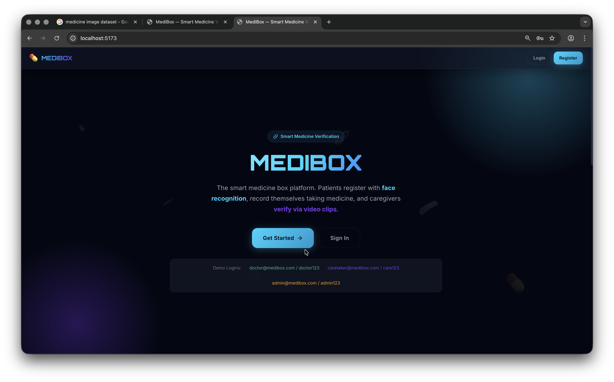

---

### 🧑‍⚕️ Patient Portal

#### Dashboard
> Patients see their medicine compliance stats at a glance — total intakes, verified doses, and compliance percentage — along with a prominent "Take Medicine Now" button and recent activity feed.

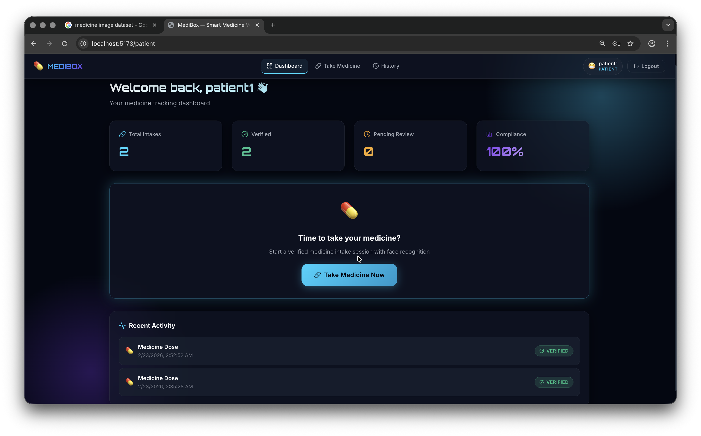

#### Take Medicine (Face-Verified Intake)
> A guided 3-step flow: verify your face → record yourself taking medicine → submit the clip for doctor review. The screenshot shows the success screen after submission.

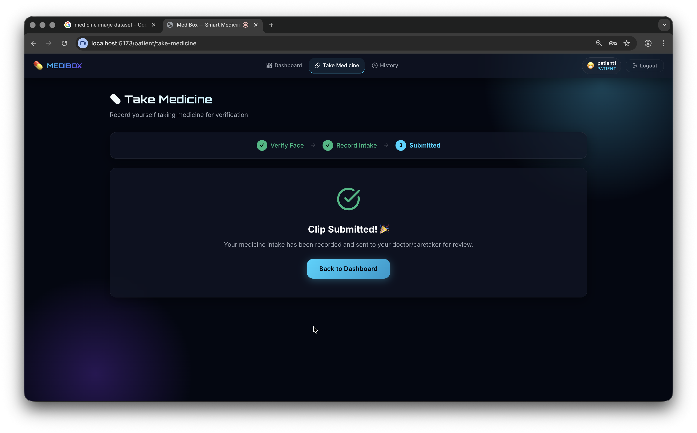

#### Medicine History
> A complete log of all past medicine intakes with timestamps, clip durations, reviewing doctor/caretaker name, and verification status (Verified / Pending).

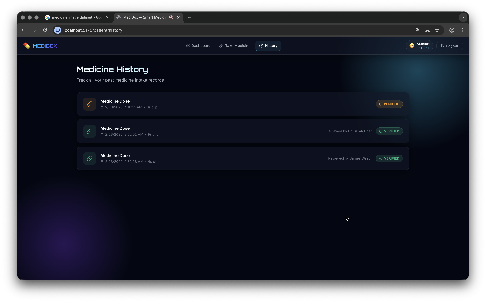

---

### 👨‍⚕️ Doctor Portal

#### Dashboard & Intake Review
> Doctors get an overview of pending reviews, accepted/rejected counts, and total patients. They can filter medicine intake clips by status and review them.

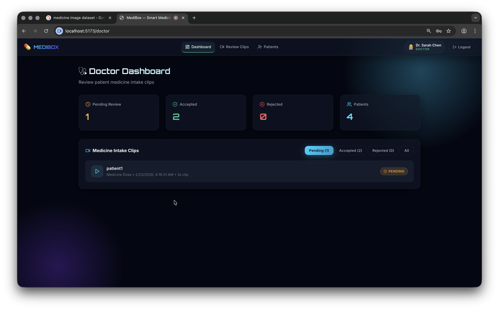

#### Review Medicine Intake Clip
> A modal allows doctors to play back the patient's recorded intake video and then accept or reject it with a single click.

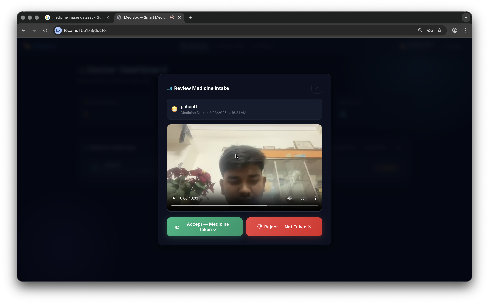

#### Patient Management
> Doctors can register patients, assign caretakers, and manage prescriptions — all from one page with quick-action buttons for each patient.

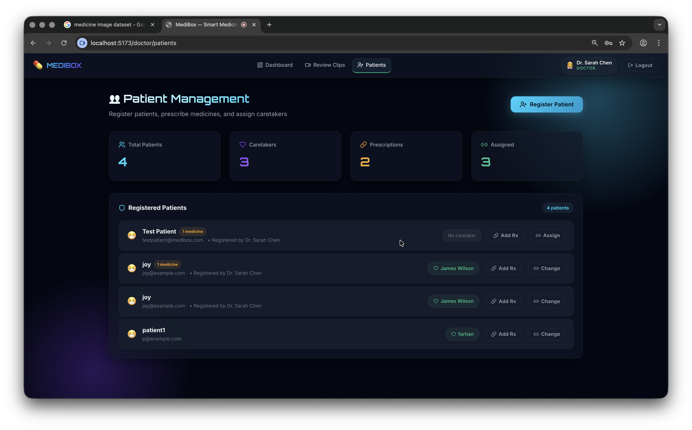

---

### 👥 Caretaker Portal

#### Dashboard
> Caretakers share a similar review interface as doctors — they can monitor assigned patients and review pending medicine intake clips.

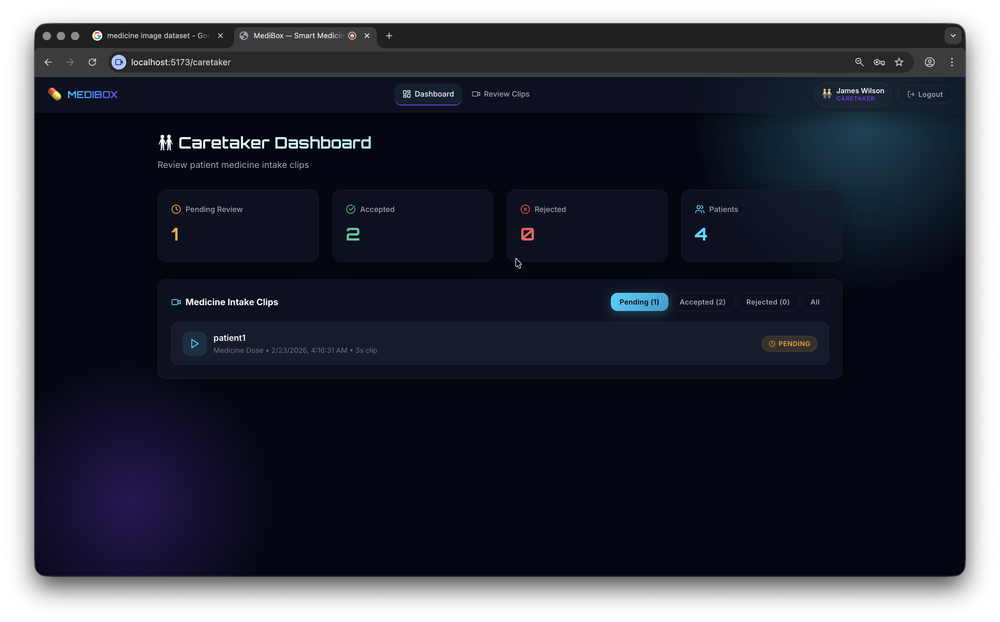

---

### 🛡️ Admin Panel

#### Dashboard
> A comprehensive system overview with total users, intake stats, AI/ML settings toggle, users-by-role breakdown, and real-time system health indicators.

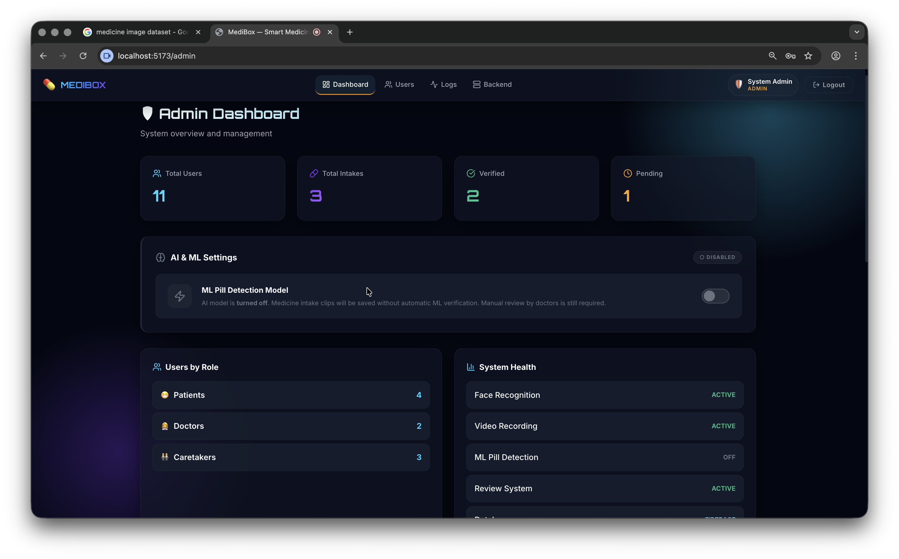

#### User Management
> A full table of all registered users showing name, email, role (color-coded badges), and join date.

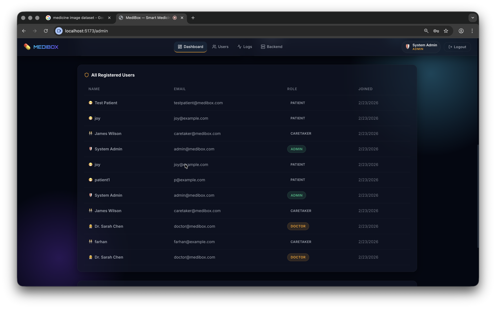

#### System Logs
> Scrollable view of all users alongside a live medicine log feed showing intake timestamps, reviewing authority, and verification status.

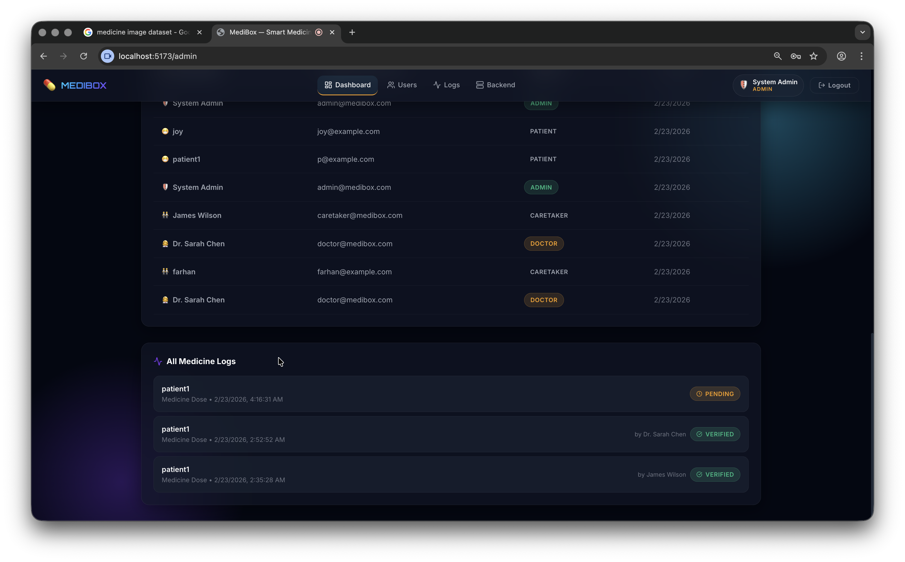

---

## 🛠️ Tech Stack

| Layer | Technology |
|-------|-----------|
| **Frontend** | React 18, React Router DOM v6 |
| **Build Tool** | Vite 6 |
| **Backend/DB** | Firebase Auth, Cloud Firestore |
| **Face Recognition** | face-api.js (TensorFlow.js-based) |
| **Video Calls** | WebRTC with Firestore signaling |
| **Icons** | Lucide React |
| **Fonts** | Inter, Orbitron (Google Fonts) |
| **Hosting** | Firebase Hosting |

---

## 🚀 Getting Started

### Prerequisites

- [Node.js](https://nodejs.org/) (v18+)
- [Firebase CLI](https://firebase.google.com/docs/cli) (for deployment)

### 1. Clone the repository

```bash
git clone https://github.com/joblesskid-2510/Abc.git
cd Abc
```

### 2. Install dependencies

```bash
npm install
```

### 3. Run the dev server

```bash
npm run dev
```

The app will be available at `http://localhost:5173`.

### 4. Build for production

```bash
npm run build
```

### 5. Deploy to Firebase

```bash
npm run build
firebase deploy
```

---

## 📁 Project Structure

```
Abc/
├── index.html                  # Entry HTML with meta & fonts
├── firebase.json               # Firebase Hosting config
├── .firebaserc                 # Firebase project alias
├── vite.config.js              # Vite configuration
├── package.json
│
└── src/
    ├── main.jsx                # App entry point
    ├── App.jsx                 # Router & route definitions
    ├── index.css               # Global styles & design system
    │
    ├── components/
    │   ├── FaceCapture.jsx     # Face registration component
    │   ├── FaceVerify.jsx      # Face verification component
    │   ├── Navbar.jsx          # Navigation bar
    │   └── ProtectedRoute.jsx  # Role-based route guard
    │
    ├── context/
    │   └── AuthContext.jsx     # Firebase auth state provider
    │
    ├── pages/
    │   ├── Landing.jsx         # Public landing page
    │   ├── Login.jsx           # Login page
    │   ├── Register.jsx        # Registration page
    │   ├── VideoCall.jsx       # WebRTC video call page
    │   ├── Chatbot.jsx         # AI chatbot interface
    │   │
    │   ├── patient/
    │   │   ├── Dashboard.jsx   # Patient home
    │   │   ├── TakeMedicine.jsx# Face-verified dose logging
    │   │   ├── History.jsx     # Medicine intake history
    │   │   └── Vitals.jsx      # Health vitals tracker
    │   │
    │   ├── doctor/
    │   │   ├── Dashboard.jsx   # Doctor home & reviews
    │   │   ├── Patients.jsx    # Patient management
    │   │   └── Appointments.jsx# Appointment scheduler
    │   │
    │   └── admin/
    │       ├── Dashboard.jsx   # Admin overview & logs
    │       └── Backend.jsx     # System management
    │
    └── utils/
        ├── firebase.js         # Firebase app initialization
        └── db.js               # Firestore CRUD helpers
```

---

## 🔐 Role-Based Access

MediBox uses Firebase Auth combined with Firestore user profiles to enforce role-based access control:

| Role | Access Level |
|------|-------------|
| `patient` | Personal dashboard, medicine intake, vitals, video calls, chatbot |
| `doctor` | Patient management, prescriptions, appointments, video calls |
| `caretaker` | Shared doctor view for monitoring assigned patients |
| `admin` | Full platform management, user administration, activity logs |

---

## 📜 Scripts

| Command | Description |
|---------|------------|
| `npm run dev` | Start Vite dev server with HMR |
| `npm run build` | Create optimized production build |
| `npm run preview` | Preview production build locally |

---

## 🤝 Contributing

1. Fork the repository
2. Create a feature branch (`git checkout -b feature/amazing-feature`)
3. Commit your changes (`git commit -m 'Add amazing feature'`)
4. Push to the branch (`git push origin feature/amazing-feature`)
5. Open a Pull Request

---

## 📄 License

This project is licensed under the MIT License.

---

<p align="center">
  Built with ❤️ using React + Firebase
</p>
